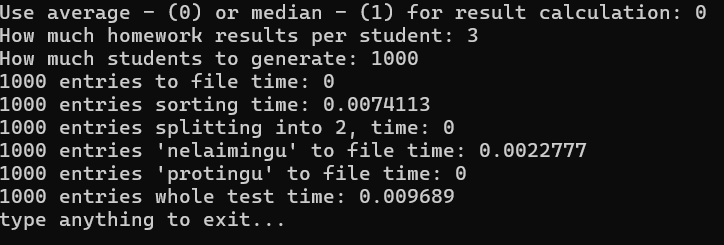
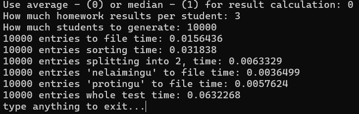
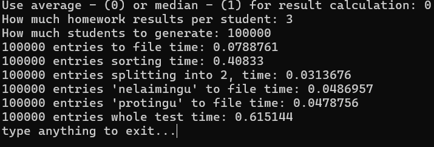
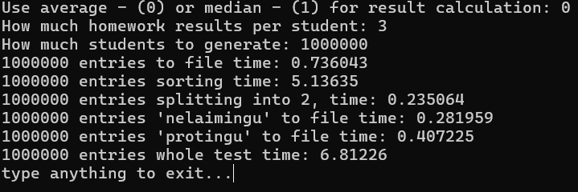
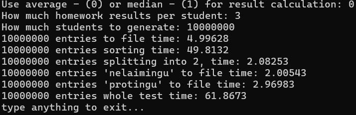

# Program that calculates students results

On average whole test time of 10000 students with 20 homework results took approximately: 0.11 seconds,
with 100000 students and 3 homework results each: 0.63 seconds.

Some examples of time tests when generating different size files:

